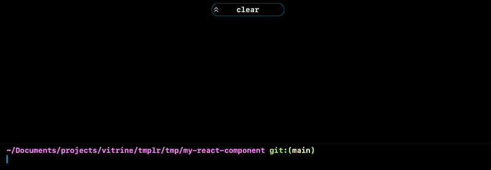

[](https://www.npmjs.com/package/tmplr)

Use `tmplr` to get a repository as a starter template for your next project. `tmplr` copies the repo (without git history, thanks to [`degit`](https://github.com/Rich-Harris/degit)), then runs a _templating recipe_ and asks a few questions to further prepare the project for you (e.g. update the owner name in LICENSE, project name in README, etc.).

<div align="center">



</div>
  
```bash
npx tmplr owner/repo                  # 👉 get repo from github
npx tmplr gitlab:user/repo            # 🥽 or gitlab
npx tmplr git@bitbucket.org:user/repo # 🪣 or bitbucket
npx tmplr https://git.sr.ht/user/repo # 🛖 or source hut
```

<br/>

You can also just create a repository using a [github template repository](https://docs.github.com/en/repositories/creating-and-managing-repositories/creating-a-repository-from-a-template), and then use `tmplr` to fill in the blanks and get you started:

```bash
cd my-new-repo
npx tmplr
```

<br/>

# Table of Contents

- [How to Install](#how-to-install)
- [How to Use](#how-to-use)
  - [Running Recipes](#running-recipes)
  - [Execution Safety](#execution-safety)
- [How to Make a Template](#how-to-make-a-template)
  - [Template Recipes](#template-recipes)
  - [GitHub Workflows](#github-workflows)
  - [Contextual Values](#contextual-values)
    - [Git Context](#git-context)
    - [Path Context](#path-context)
    - [Environment Variables](#environment-variables)
    - [Temporary Directories](#temporary-directories)
    - [Recipe Arguments](#recipe-arguments)
  - [Recipe Syntax](#recipe-syntax)
    - [Commands](#commands)
    - [Expressions](#expressions)
    - [Pipes](#pipes)

<br/>

# How to Install

You need to have [Node.js and NPM installed](https://docs.npmjs.com/downloading-and-installing-node-js-and-npm).
You don't need to install `tmplr` itself, since you can use it with [`npx`](https://www.npmjs.com/package/npx):

```bash
npx tmplr owner/repo
```

<br/>

However, you _can_ install it globally for more convenience:

```bash
npm i -g tmplr
```
```bash
tmplr owner/repo    # 3 less characters per project 🍺
```

<br/>

# How to Use

If the repository is on github, simply pass `owner/repo` to `tmplr`. For example, if you want to [create a reusable React component using this template](https://github.com/vitrin-app/react-component-template), you can run the following:
```bash
npx tmplr vitrin-app/react-component-template
```

<br/>

Also works with public repositories on other sources:

```bash
# 🥽 download from GitLab
tmplr gitlab:owner/repo
tmplr git@gitlab.com:owner/repo
tmplr https://gitlab.com/owner/repo

# 🪣 download from BitBucket
tmplr bitbucket:owner/repo
tmplr git@bitbucket.org:owner/repo
tmplr https://bitbucket.org/owner/repo

# 🛖 download from Sourcehut
tmplr git.sr.ht/owner/repo
tpmlr git@git.sr.ht:owner/repo
tpmlr https://git.sr.ht/owner/repo
```

<br/>

You can also specify a tag, branch, commit or subdirectory:

```bash
tmplr owner/repo#branch       # 👉 branch
tmplr owner/repo#tag          # 👉 release tag
tmplr owner/repo#c0m1th45h    # 👉 commit hash
tmplr owner/repo/subdirectory # 👉 sub directory
```

<br/>

## Running Recipes

If you receive the content of the template repository via other means (for example [via GitHub template repos](https://docs.github.com/en/repositories/creating-and-managing-repositories/creating-a-repository-from-a-template), and the repository
provides a `tmplr` templating recipe, you can run it by going to the directory where the project is and run the following:

```bash
npx tmplr
```

<br/>

> When executed without a parameter, `tmplr` will try to locate `.tmplr.yml` recipe file in current folder and run the recipe.

<br/>

## Execution Safety

Running `tmplr` is basically as safe as downloading a bunch of files into a specified folder. Templating recipes can only read values
from [controlled contexts](#contextual-values) and user prompts, and can only modify contents of files in the same directory by replacing
string values from values read. Recipes CAN NOT ACCESS OR MODIFY any file outside the current directory. Note that they DO get access to your
environment variables.

<br/><br/>

# How to Make a Template

Add a template recipe that instructs `tmplr` what to do (for example, update the project name in README). A template recipe is a [YAML file](https://en.wikipedia.org/wiki/YAML) named `.tmplr.yml`, located at the root of your repository. When running the following:

```bash
npx tmplr your/repo
```

`tmplr` will copy the contents of your repo and then execute the recpie. Alternatively, if someone receives the content of your template repository via other means (for example, using GitHub templates), they can simply execute the recipe by running the following:

```bash
npx tmplr
```

<br/>

## Template Recipes

A template recipe instructs `tmplr` as to how to update project files with contextual values such as local git information or directory name. It can be a single command:

```yaml
# .tmplr.yml
remove: LICENSE
```

Or multiple steps:

```yaml
# .tmplr.yml
steps:
  - read: project_name
    from: git.remote_name
    fallback:
      from: path.rootdir
  
  - read: clone_url
    from: git.remote_url
  
  - update: README.md
```

Where `README.md` can be something like this:

````md
# {{ tmplr.project_name }}

This is my super awesome project. You can clone it using the following command:
```bash
git clone {{ tmplr.clone_url }}
```
````

<br/>

After you read a variable such as `some_var`, in any file you update or copy, `{{ tmplr.some_var }}` will be replaced with the value read. If a variable is not resolved or read, then `tmplr` will leave it untouched. The comprehensive list of all available commands can be found in [this section](#recipe-syntax), and a list of available contextual values (e.g. `git.remote_url` or `path.rootdir`) can be found in [this section](#contextual-values). If you prefer learning by example, you can [check this example template repository](https://github.com/loreanvictor/tmplr-template-example).

<br/>

## GitHub Workflows

If values you need for templating can all be found in [GitHub Action contexts](https://docs.github.com/en/actions/learn-github-actions/contexts), then you can also just [create a GitHub template](https://docs.github.com/en/repositories/creating-and-managing-repositories/creating-a-template-repository), and then add a workflow to run `tmplr` to apply your templating recipe. You can find an example of this [in the example template](https://github.com/loreanvictor/tmplr-template-example).

```yaml
# .github/workflows/init.yml
name: Initialize Template

#
# Run this on creation of a branch or ref
#
on:
  push:
    branches: main

jobs:
  build:
    #
    # Change this to make sure your workflow doesn't initialize on your template!
    #
    if: github.repository != '<your-user-name>/<template-repo-name>'

    runs-on: ubuntu-latest
    steps:
      #
      # Checkout the code
      #
      - uses: actions/checkout@v2
      
      #
      # Check if there is a template recipe
      #
      - id: template_exists
        name: Check template
        uses: andstor/file-existence-action@v1
        with:
          files: .tmplr.yml
      
      #
      # Run tmplr with required environment variables,
      # and remove the template recipe afterwards.
      #
      # Use this to get all the values you want from GitHub Action contexts
      # and set them as environment variables for tmplr.
      #
      - name: Apply template
        if: steps.template_exists.outputs.files_exists == 'true'
        run: npx tmplr && rm -fr .tmplr.yml && rm -fr .github/workflows/init.yml
        env:
          owner_name: ${{ github.event.repository.owner.name }}
          owner_email: ${{ github.event.repository.owner.email }}
          repo_name: ${{ github.event.repository.name }}
          repo_url: ${{ github.event.repository.ssh_url }}

      #
      # Commit the code
      #
      - uses: EndBug/add-and-commit@v9
        with:
          message: Initialize from template
```

<br/>

## Contextual Values

Recipes might have access to following contextual values, depending on the conditions (for example, if the repository is executed outside of a git repository, then `git.*` values are not available).

### Git Context

- `git.remote_url`: The origin URL of current git repository (this can be cloned, for example)
- `git.remote_name`: The name of the origin (e.g. repository name)
- `git.remote_provider`: The address of the git host (e.g. `https://github.com`)
- `git.remote_owner`: The name of the user on the remote who owns the repository
- `git.author_name`: The name of the person who made the first commit on the repo
- `git.author_email`: Email address of the first committer.

### Path Context

- `path.rootdir`: The name of the root directory
- `path.rootempty`: This is an empty string if root directory is not empty, and `yes` if it is. `.git` and `.tmplr.yml` are ignored.

### Environment Variables

You can use `env.some_var` to access some environment variable. If it is not defined, an empty string will be returned.

### Temporary Directories

You can access `tmpdir.some_name` to automatically create temporary directories.

```yml
steps:
  #
  # some initial steps 
  #
  
  - copy: some_file.go
    to:
      eval: '{{ tmpdir.go_file }}/some_file.go'
      
  #
  # some other steps
  #
  
  - copy:
      eval: '{{ tmpdir.go_file }}/some_file.go'
    to: some_other_file.go
```

Temporary directories will be deleted after the recipe has finished executing.

<br/>

### Recipe Arguments

Recipes can also [run](#run) other local recipes or [use](#use) publicly published recipes. The caller recipe can pass arguments
to the called recipe, which will be available on `args` context.

```yml
# called.yml
steps:
  - read: remote_url
    from: git.remote_url
    
  - update:
      path: '{{ args.readme }}'
```
```yml
# .tmplr.yml
steps:
  - run: ./called.yml
    with:
      - readme:
          path: ./README.md
```
<br/>

> 👉 Recipe arguments are evaluated lazily. For example, if a prompt is passed as an argument, the user will be prompted the first time you
> access that argument.

<br/>

## Recipe Syntax

Template recipes are composed of _commands_ and _expressions_. _Commands_ instruct actions that are to be taken (i.e. read a value, update a file, etc), and _expressions_ calculate string values used by commands. A template recipe descirbes a single command, which can itself be composed of multiple other
steps:

<br/>

```yaml
# .tmplr.yml
remove: LICENSE
```
☝️ Here the recipe is a single _remove_ command.

<br/>

```yaml
# .tmplr.yml
steps:
  - read: project_name
    from: git.remote_name
    fallback:
      prompt: What is the name of the project?
      default:
        from: path.rootdir
  
  - update: README.md
```

☝️ Here the recipe is a single _steps_ command, which is composed of multiple steps (each another command). Take a closer look at the initial _read_ command:

```yml
  - read: project_name
    from: git.remote_name
    fallback:
      prompt: What is the name of the project?
      default:
        from: path.rootdir
```

The [read](#read) command reads a value from an expression and stores it in a variable. From this point on, when [copy](#copy) or [update](#update) contents of a file, if the file contains `{{ tmplr.project_name }}`, the value resolved here will be replaced. Here we read a value using a _From Expression_, i.e. we read _from_ a contextual value (in this case, the remote name for the git repository). If the contextual value can't be resolved (for example, the command is executed outside of a git repo), then the fallback expression will be used, which is a _prompt_ asking the user for the value, and so on.

Here you can see the corresponding syntax tree of this example recipe:
```
Steps Command
  ┃
  ┣━━ Read Command
  ┃     ┃	
  ┃     ┗━━ From Expression
  ┃          ┃	
  ┃          ┗━(fallback)━ Prompt Expression
  ┃               ┃	
  ┃               ┗━(default)━ From Expression
  ┃
  ┗━ Update Command
       ┃
       ┗━ Value Expression
```

Note that the single string passed to the [update](#update) command is also an expression. Except in cases where the expression is attached to the command (like in case of the [read command](#read)), expressions can be simple string values or more complex objects. For example, we can replace the _default_ of the prompt from a _From Expression_ to a simple string:

```yml
  - read: project_name
    from: git.remote_name
    fallback:
      prompt: What is the name of the project?
      default: My Awesome Project
```

<br/>

### Commands

Commands instruct `tmplr` to read values, update contents of files, etc. Here you can see an overview of all available commands:

- [**read**](#read): reads a value into a variable, so that the variable can be used to update subsequent files.
- [**update**](#update): updates contents of a file, replacing variables with values read.
- [**copy**](#copy): copy contents of a file to a new file, while replacing variables with values read.
- [**remove**](#remove): removes a file.
- [**steps**](#steps): runs a bunch of commands in a step by step manner.
- [**degit**](#degit): copies content of given repository to given folder, without bringing the git history.
- [**exit**](#exit): ends the recipe early.
- [**run**](#run): runs another local recipe file, with given arguments.
- [**use**](#use): runs a remote recipe file, with given arugments.

<br/>

#### Read

> _Command_
> 
> ```yml
> read: <variable name>
> <expression>
> ```

Reads some value into a variable. The variable then can be used in updating / copying file contents.
```yml
steps:
  - read: project_name
    from: path.rootdir
```
☝️ After executing this command, if you [update](#update) or [copy](#copy) any file that contains `{{ tmplr.project_name }}`, the value read by this command will be replaced.

<br/>

#### Update
> _Command_
> ```yml
> update:
>   <expression>
> ```
Updates contents of a file, using values read with [`read`](#read).
```yml
steps:
  - read: name
    prompt: What is your name?
  
  - update: README.md
```
```yml
steps:
  - read: docs_folder
    prompt: Where do you keep the docs?
    choices:
      - docs
      - documents
      - other:
          prompt: Specify the folder name ...
  - update:
      path: '{{ docs_folder }}/Home.md'
```

<br/>

#### Copy
> _Command_
> ```yml
> copy:
>   <expression>
> to:
>   <expression>
Copies content of given file to a new file on given name/address. Will create required folders, also if a file with given destination address
exists, will replace it. Will replace all `tmplr` variables (i.e. `{{ tmplr.some_var }}` in the content of the new file based on values [read](#read).
```yml
steps:
  - read: email
    from: git.author_email
  
  - copy: .template/CODE_OF_CONDUCT
    to: CODE_OF_CONDUCT
```
```yml
steps:
  - read: email
    from: git.author_email
  
  - degit: some/license_template
    to:
      path: '{{ tmpdir.license }}'
  
  - copy:
      path: '{{ tmpdir.license }}/LICENSE'
    to: LICENSE
```
<br/>

#### Remove
> _Command_
> ```yml
> remove:
>   <expression>
> ```
Removes given file. Can also remove a folder.
```yml
steps:
  # do some other stuff
  
  - remove: .tmplr.yml
```

<br/>

#### Steps
> _Command_
> ```yml
> steps:
>   - <command>
>   - <command>
>   - ...
> ```
Runs given commands step by step.
```yml
steps:
  - read: name
    from: git.author_name
    fallback:
      from: env.USER
  
  - update: package.json
  - copy: .template/README.md
    to: README.md
  - remove: .template
```
  
<br/>
  
#### Degit

> _Command_
> ```yml
> degit:
>   <expression>
> to?:
>   <expression>
> ```
Will fetch the contents of given repository and copy them into specified folder. If destination is not specified, will copy
into the same folder as the running recipe. Accepts the same sources as `tmplr` command itself (basically runs [degit](https://github.com/Rich-Harris/degit)).
```yml
steps:
  - degit: user/repo
    to:
      eval: '{{ tmpdir.repo }}'
```

<br/>
  
#### Exit
> _Command_
> ```yml
> exit:
>   <expression>
> ```
Will end the templating process early (for example because value is not set or due to user's choice). Will evaluate and display given
message.
```yml
steps:
  - read: remote_url
    from: git.remote_url
    fallback:
      eval: _
      steps:
        - exit: Must be a git repository!

  # ...
```

<br/>

#### Run
> _Command_
> ```yml
> run:
>   <expression>
> with?:
>   - <argname>:
>       <expression>
>   - <argname>:
>       <expression>
>   ...
> read?:
>   - <varname>: <outname>
>   - <varname>: <outname>
>   ...
> ```
Parses and executes given local recipe file. You can pass arguments to the recipe file (which can be accessed via the [`args` context](#recipe-arguments) lazily. The recipe WILL NOT have access to variables you have read, so you need to manually pass them as arguments. You can access all the variables
read by the recipe though, and read them into variables of your own execution context.

```yml
steps:
  - read: name
    from: git.author_name

  - run: .templates/util/some-recipe.yml
    with:
      - name                   # will directly pass `name`
      - remote_url:
          from: git.remote_url # this will be executed lazily
          fallback:
            prompt: What is the remote URL?
    read:
      - lockfile               # will read `lockfile` variable of the inner recipe into `lockfile` variable of outer recipe
      - some_success: success  # will read `success` variable of the inner recipe into `some_success` variable of outer recipe
```

<br/>

Note that all relative paths inside any recipe are resolved _relative to the recipe file itself_. So in case of above example, the caller recipe referencing `README.md` will access `README.md` at the root of the project, while the called recipe accessing `README.md` would access `.templates/util/README.md`. This means the string `README.md` or `./README.md` mean different things for different recipes. To avoid such
confusions, use the [path](#path) expression to turn all path strings into absolute paths.

<br/>

#### Use
> _Command_
> ```yml
> use:
>   <expression>
> with?:
>   - <argname>:
>       <expression>
>   - <argname>:
>       <expression>
>   ...
> read?:
>   - <varname>: <outname>
>   - <varname>: <outname>
>   ...
> ```
Will download, parse and execute given recipe from a public repository. Will first fetch the specified repository (via [degit](#degit))
into a temporary directory at the root of the project, and then locate `.tmplr.yml` in that directory and [run](#run) it. The specified
repository MUST have a `.tmplr.yml` file at its root.

```yml
steps:
  - read: name
    from: git.author_name

  - use: some-user/some-repo
    with:
      - name                   # will directly pass `name`
      - remote_url:
          from: git.remote_url # this will be executed lazily
          fallback:
            prompt: What is the remote URL?
    read:
      - lockfile               # will read `lockfile` variable of the inner recipe into `lockfile` variable of outer recipe
      - some_success: success  # will read `success` variable of the inner recipe into `some_success` variable of outer recipe
```

<br/>

Since the whole repo is fetched, the recipe can also utilize other templating files shipped alongside it. Since it will be put in a temporary
directory at the root of the project, it can relatively access files via `../` (for example, the main readme will be at `../README.md`).

```yml
# https://github.com/some-user/some-repo/.tmplr.yml
steps:
  - read: some_variable
    from: some.context

  - copy: ./README.md
    to: ../README.md
```

<br/>

### Expressions

Expressions calculate string values used by commands. Here is an overview of all available expressions:

- [**from**](#from): reads from a contextual value.
- [**prompt**](#prompt): asks the value from user.
- [**choices**](#choices): asks the value from user, but gives them some predetermined choices.
- [**eval**](#eval): evaluates an expression.
- [**path**](#path): evaluates to an absolute path value.

<br/>

#### From
> _Expression_
> ```yml
> from: <contextual-variable>
> fallback?:
>   <expression>
> ```
Will resolve from the value of given contextual variable. If it is not present and fallback is specified, will evaluate
and return the fallback expression. Otherwise will return an empty string.
```yml
steps:
  - read: username
    from: git.remote_owner
    fallback:
      from: env.USER
```

<br/>

#### Prompt
> _Expression_
> ```yml
> prompt: <message>
> default?:
>   <expression>
>```
Will resolve the value by asking the user. If a default value is provided, then that will be suggested to the user
as well.
```yml
steps:
  - read: username
    prompt: What is your username?
    default:
      from: git.author_name
      fallback:
        from: env.USER
```

<br/>

#### Choices
> _Expression_
> ```yml
> prompt: <message>
> choices:
>   - <label>:
>       <expression>
>   - <label>:
>       <expression>
>   ...
> ```
Will resolve the value by giving the user multiple choices. Will evaluate the corresponding expression of each choice _after_ the user
has selected it (so you can chain prompts and other expressions safely).
```yml
steps:
  - read: username
    prompt: What is your username?
    choices:
      - Read it from git:
          from: git.author_name
      - Read it from env:
          from: env.USER
      - John Doe # 👉 here the value is the same as the label.
      - None:
          prompt: Ok but what is your username though?
```

<br/>

#### Eval
> _Expression_
> ```yml
> eval: <expr>
> steps?:
>   - <command>
>   - <command>
>   ...
> ```

Will evaluate given string expression. This is almost similar to evaluation of template variables in [updated](#update) or [copied](#copy)
files. The main difference is that in eval expressions you don't need the `tmplr.` prefix to access [read](#read) variables, and you can also
access other contextual values. [Pipes](#pipes) work similar to other files.

```yml
steps:  
  read: git_url
  from: git.remote_url
  fallback:
    eval: 'https://github.com/{{ env.USER | snake_case }}/{{ path.rootdir }}.git'
```

You can optionally pass a list of commands as the _steps_ property. These are usually (but not necessarily) some [read](#read)
commands to fetch further values required for the evaluation. Note that these commands only get executed if the _Eval Expression_
itself is evaluated.

```yml
steps:
  - read: git_url
    from: git.remote_url
    fallback:
      steps:
        - read: git_provider
          prompt: Where is the project hosted?
          choices:
            - GitHub: 'https://github.com'
            - BitBucket: 'https://bitbucket.org'
            - Source Hut: 'https://git.sr.ht'
            - Other:
                prompt: Please specify ...
        - read: git_owner
          from: env.USER
          fallback:
            prompt: What is your username?
      eval: '{{ git_provider }}/{{ git_owner }}/{{ path.rootdir }}.git'  
```

<br/>

#### Path
> _Expression_
> ```yml
> path: <expr>
> ```
Similar to [**eval**](#eval) but for strings representing file paths. If the expression evaluates to a relative path, will
turn it into an absolute path assuming the recipe file itself as the root of the address. This will be useful for passing path
arguments to and reading path values from other recipes executed via [run](#run) or [use](#use) commands.
```yml
steps:
  # ...
  - degit: some/repo
    to:
      eval: '{{ tmpdir.some_repo }}'

  - use: some/recipe
    with:
      - readme:
          path: '{{ tmpdir.some_repo }}/README.md'
```

<br>

### Pipes

Templating variables referenced in files or in the recipe (i.e. `{{ some_var }}`, `{{ git.some_var }}` or `{{ tmplr.some_var }}`) can also
be further modified with _pipes_:
  
```yaml
# .tmplr.yml
steps:
  - read: name
    prompt: whats the name?
  
  - copy: .templates/template.md
    to:
      eval: '{{ name | path/case }}.md'

  - remove: .templates
```

````markdown
<!-- .templates/template.md -->

# {{ tmplr.name | Capital Case }}

This is a super awesome project that can be installed by running:
```bash
npm i {{ tmplr.name | kebab-case }}
```
````
☝️ Running this recipe with the name `cool project` will result in `cool/project.md` with the following contents:
````markdown
# Cool Project

This is a super awesome project that can be installed by running:
```bash
npm i cool-project
```
````

<br>

Most pipes do not accept arguments are just for changing the letter case of the string. Here is a list of supported letter cases:

```
- camelCase           - Capital Case       - CONSTANT_CASE 
- dot.case            - Header-Case        - kebab-case
- PascalCase          - path/case          - param-case
- Sentence case       - UPPERCASE          - lowercase
```

<br>
  
Additionally, there are `skip` and `trim` pipes as well, which will remove the given number of characters from the beginning and
the end of the string respectively:

```yml
steps:
  - read: component_name
    prompt: What is the name of the component?
    default:
      #
      # if the directory name is 'react-my-component', then
      # this will evaluate to 'MyComponent'.
      #
      eval: '{{ path.rootdir | skip: 6 | PascalCase }}'
```

Alternatively, you can pass string values to `trim` and `skip`, in which case they will remove the given string
from the start / end of the string only if the string starts / ends with the given string:

```yml
steps:
  - read: component_name
    prompt: What is the name of the component?
    default:
      #
      # if the directory name is 'react-my-component', then
      # this will evaluate to 'MyComponent'. However, if the
      # directory name does not start with 'react-', then it will
      # not modify it.
      #
      eval: '{{ path.rootdir | skip: react- | PascalCase }}'
```

<br>
