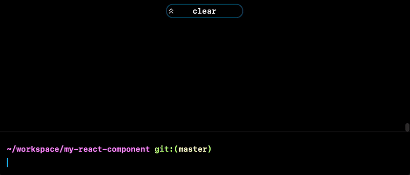

[](https://www.npmjs.com/package/tmplr)

Use `tmplr` to get a repository as a starter template for your next project. `tmplr` copies the repo (without git history, thanks to [`degit`](https://github.com/Rich-Harris/degit)), then runs a _templating recipe_ and asks a few questions to further prepare the project for you (e.g. update the owner name in LICENSE, project name in README, etc.).

<div align="center">



</div>
  
```bash
npx tmplr owner/repo                  # 👉 get repo from github
npx tmplr gitlab:user/repo            # 🥽 or gitlab
npx tmplr git@bitbucket.org:user/repo # 🪣 or bitbucket
npx tmplr https://git.sr.ht/user/repo # 🛖 or source hut
```

<br/>

You can also just create a repository using a [github template repository](https://docs.github.com/en/repositories/creating-and-managing-repositories/creating-a-repository-from-a-template), and then use `tmplr` to fill in the blanks and get you started:

```bash
cd my-new-repo
npx tmplr
```

<br/>

# Table of Contents

- [How to Install](#how-to-install)
- [How to Use](#how-to-use)
  - [Running Recipes](#running-recipes)
- [How to Make a Template](#how-to-make-a-template)
  - [Template Recipes](#template-recipes)
  - [GitHub Workflows](#github-workflows)
  - [Contextual Values](#contextual-values)
    - [Git Context](#git-context)
    - [Path Context](#path-context)
    - [Environment Variables](#environment-variables)
    - [Temporary Directories](#temporary-directories)
  - [Recipe Syntax](#recipe-syntax)
    - [Read](#read)
    - [Update](#update)
    - [Copy](#copy)
    - [Remove](#remove)
    - [Steps](#steps)

<br/>

# How to Install

You need to have [Node.js and NPM installed](https://docs.npmjs.com/downloading-and-installing-node-js-and-npm).
You don't need to install `tmplr` itself, since you can use it with [`npx`](https://www.npmjs.com/package/npx):

```bash
npx tmplr owner/repo
```

<br>

However, you _can_ install it globally for more convenience:

```bash
npm i -g tmplr
```
```bash
tmplr owner/repo    # 3 less characters per project 🍺
```

<br/>

# How to Use

If the repository is on github, simply pass `owner/repo` to `tmplr`. For example, if you want to [create a reusable React component using this template](https://github.com/vitrin-app/react-component-template), you can run the following:
```bash
npx tmplr vitrin-app/react-component-template
```

<br/>

Also works with public repositories on other sources:

```bash
# 🥽 download from GitLab
tmplr gitlab:owner/repo
tmplr git@gitlab.com:owner/repo
tmplr https://gitlab.com/owner/repo

# 🪣 download from BitBucket
tmplr bitbucket:owner/repo
tmplr git@bitbucket.org:owner/repo
tmplr https://bitbucket.org/owner/repo

# 🛖 download from Sourcehut
tmplr git.sr.ht/owner/repo
tpmlr git@git.sr.ht:owner/repo
tpmlr https://git.sr.ht/owner/repo
```

<br/>

You can also specify a tag, branch, commit or subdirectory:

```bash
tmplr owner/repo#branch       # 👉 branch
tmplr owner/repo#tag          # 👉 release tag
tmplr owner/repo#c0m1th45h    # 👉 commit hash
tmplr owner/repo/subdirectory # 👉 sub directory
```

<br/>

## Running Recipes

If you receive the content of the template repository via other means (for example [via GitHub template repos](https://docs.github.com/en/repositories/creating-and-managing-repositories/creating-a-repository-from-a-template), and the repository
provides a `tmplr` templating recipe, you can run it by going to the directory where the project is and run the following:

```bash
npx tmplr
```

<br>

> When executed without a parameter, `tmplr` will try to locate `.tmplr.yml` recipe file in current folder and run the recipe.

<br><br>

# How to Make a Template

Add a template recipe that instructs `tmplr` what to do (for example, update the project name in README). A template recipe is a [YAML file](https://en.wikipedia.org/wiki/YAML) named `.tmplr.yml`, located at the root of your repository. When running the following:

```bash
npx tmplr your/repo
```

`tmplr` will copy the contents of your repo and then execute the recpie. Alternatively, if someone receives the content of your template repository via other means (for example, using GitHub templates), they can simply execute the recipe by running the following:

```bash
npx tmplr
```

<br>

## Template Recipes

A template recipe instructs `tmplr` as to how to update project files with contextual values such as local git information or directory name. It can be a single command:

```yaml
# .tmplr.yml
remove: LICENSE
```

Or multiple steps:

```yaml
# .tmplr.yml
steps:
  - read: project_name
    from: git.remote_name
    fallback:
      from: path.rootdir
  
  - read: clone_url
    from: git.remote_url
  
  - update: README.md
```

Where `README.md` can be something like this:

````md
# {{ tmplr.project_name }}

This is my super awesome project. You can clone it using the following command:
```bash
git clone {{ tmplr.clone_url }}
```
````

<br>

After you read a variable such as `some_var`, in any file you update or copy, `{{ tmplr.some_var }}` will be replaced with the value read. If a variable is not resolved or read, then `tmplr` will leave it untouched. The comprehensive list of all available commands can be found in [this section](#recipe-syntax), and a list of available contextual values (e.g. `git.remote_url` or `path.rootdir`) can be found in [this section](#contextual-values). If you prefer learning by example, you can [check this example template repository](https://github.com/loreanvictor/tmplr-template-example).

<br>

## GitHub Workflows

If values you need for templating can all be found in [GitHub Action contexts](https://docs.github.com/en/actions/learn-github-actions/contexts), then you can also just [create a GitHub template](https://docs.github.com/en/repositories/creating-and-managing-repositories/creating-a-template-repository), and then add a workflow to run `tmplr` to apply your templating recipe. You can find an example of this [in the example template](https://github.com/loreanvictor/tmplr-template-example).

```yaml
# .github/workflows/init.yml
name: Initialize Template

#
# Run this on creation of a branch or ref
#
on:
  push:
    branches: main

jobs:
  build:
    #
    # Change this to make sure your workflow doesn't initialize on your template!
    #
    if: github.repository != '<your-user-name>/<template-repo-name>'

    runs-on: ubuntu-latest
    steps:
      #
      # Checkout the code
      #
      - uses: actions/checkout@v2
      
      #
      # Check if there is a template recipe
      #
      - id: template_exists
        name: Check template
        uses: andstor/file-existence-action@v1
        with:
          files: .tmplr.yml
      
      #
      # Run tmplr with required environment variables,
      # and remove the template recipe afterwards.
      #
      # Use this to get all the values you want from GitHub Action contexts
      # and set them as environment variables for tmplr.
      #
      - name: Apply template
        if: steps.template_exists.outputs.files_exists == 'true'
        run: npx tmplr && rm -fr .tmplr.yml && rm -fr .github/workflows/init.yml
        env:
          owner_name: ${{ github.event.repository.owner.name }}
          owner_email: ${{ github.event.repository.owner.email }}
          repo_name: ${{ github.event.repository.name }}
          repo_url: ${{ github.event.repository.ssh_url }}

      #
      # Commit the code
      #
      - uses: EndBug/add-and-commit@v9
        with:
          message: Initialize from template
```

<br>

## Contextual Values

Recipes might have access to following contextual values, depending on the conditions (for example, if the repository is executed outside of a git repository, then `git.*` values are not available).

### Git Context

- `git.remote_url`: The origin URL of current git repository (this can be cloned, for example)
- `git.remote_name`: The name of the origin (e.g. repository name)
- `git.remote_provider`: The address of the git host (e.g. `https://github.com`)
- `git.remote_owner`: The name of the user on the remote who owns the repository
- `git.author_name`: The name of the person who made the first commit on the repo
- `git.author_email`: Email address of the first committer.

### Path Context

- `path.rootdir`: The name of the root directory
- `path.rootempty`: This is an empty string if root directory is not empty, and `yes` if it is. `.git` and `.tmplr.yml` are ignored.

### Environment Variables

You can use `env.some_var` to access some environment variable. If it is not defined, an empty string will be returned.

### Temporary Directories

You can access `tmpdir.some_name` to automatically create temporary directories.

```yml
steps:
  #
  # some initial steps 
  #
  
  - copy: some_file.go
    to:
      eval: '{{ tmpdir.go_file }}/some_file.go'
      
  #
  # some other steps
  #
  
  - copy:
      eval: '{{ tmpdir.go_file }}/some_file.go'
    to: some_other_file.go
```

Temporary directories will be deleted after the recipe has finished executing.

<br>

## Recipe Syntax

Template recipes are composed of _commands_ and _expressions_. _Commands_ instruct actions that are to be taken (i.e. read a value, update a file, etc), and _expressions_ calculate string values used by commands. A template recipe descirbes a single command, which can itself be composed of multiple other
steps:

<br>

```yaml
# .tmplr.yml
remove: LICENSE
```
☝️ Here the recipe is a single _remove_ command.

<br>

```yaml
# .tmplr.yml
steps:
  - read: project_name
    from: git.remote_name
    fallback:
      prompt: What is the name of the project?
      default:
        from: path.rootdir
  
  - update: README.md
```

☝️ Here the recipe is a single _steps_ command, which is composed of multiple steps (each another command). Take a closer look at the initial _read_ command:

```yml
  - read: project_name
    from: git.remote_name
    fallback:
      prompt: What is the name of the project?
      default:
        from: path.rootdir
```

The [read](#read) command reads a value from an expression and stores it in a variable. From this point on, when [copy](#copy) or [update](#update) contents of a file, if the file contains `{{ tmplr.project_name }}`, the value resolved here will be replaced. Here we read a value using a _From Expression_, i.e. we read _from_ a contextual value (in this case, the remote name for the git repository). If the contextual value can't be resolved (for example, the command is executed outside of a git repo), then the fallback expression will be used, which is a _prompt_ asking the user for the value, and so on.

Here you can see the corresponding syntax tree of this example recipe:
```
Steps Command
  ┃
  ┣━━ Read Command
  ┃     ┃	
  ┃     ┗━━ From Expression
  ┃          ┃	
  ┃          ┗━(fallback)━ Prompt Expression
  ┃               ┃	
  ┃               ┗━(default)━ From Expression
  ┃
  ┗━ Update Command
       ┃
       ┗━ Value Expression
```

Note that the single string passed to the [update](#update) command is also an expression. Except in cases where the expression is attached to the command (like in case of the [read command](#read)), expressions can be simple string values or more complex objects. For example, we can replace the _default_ of the prompt from a _From Expression_ to a simple string:

```yml
  - read: project_name
    from: git.remote_name
    fallback:
      prompt: What is the name of the project?
      default: My Awesome Project
```

<br>

### Read

> _Command_
> 
> ```yml
> read: <variable name>
> <expression>
> ```

Reads some value into a variable. The variable then can be used in updating / copying file contents.
```yml
steps:
  - read: project_name
    from: path.rootdir
```
☝️ After executing this command, if you [update](#update) or [copy](#copy) any file that contains `{{ tmplr.project_name }}`, the value read by this command will be replaced.

<br>

### Update
> _Command_
> ```yml
> update:
>   <expression>
> ```
Updates contents of a file, using values read with [`read`](#read).
```yml
steps:
  - read: name
    prompt: What is your name?
  
  - update: README.md
```
```yml
steps:
  - read: docs_folder
    prompt: Where do you keep the docs?
    choices:
      - docs
      - documents
      - other:
          prompt: Specify the folder name ...
  - update:
      path: '{{ docs_folder }}/Home.md'
```

<br>

### Copy
> _Command_
> ```yml
> copy:
>   <expression>
> to:
>   <expression>
Copies content of given file to a new file on given name/address. Will create required folders, also if a file with given destination address
exists, will replace it. Will replace all `tmplr` variables (i.e. `{{ tmplr.some_var }}` in the content of the new file based on values [read](#read).
```yml
steps:
  - read: email
    from: git.author_email
  
  - copy: .template/CODE_OF_CONDUCT
    to: CODE_OF_CONDUCT
```
```yml
steps:
  - read: email
    from: git.author_email
  
  - degit: some/license_template
    to:
      path: '{{ tmpdir.license }}'
  
  - copy:
      path: '{{ tmpdir.license }}/LICENSE'
    to: LICENSE
```
<br>

### Remove
> _Command_
> ```yml
> remove:
>   <expression>
> ```
Removes given file. Can also remove a folder.
```yml
steps:
  # do some other stuff
  
  - remove: .tmplr.yml
```

<br>

### Steps
> _Command_
> ```yml
> steps:
>   - <command>
>   - <command>
>   - ...
> ```
Runs given commands step by step.
```yml
steps:
  - read: name
    from: git.author_name
    fallback:
      from: env.USER
  
  - update: package.json
  - copy: .template/README.md
    to: README.md
  - remove: .template
```
<br><br><br>
