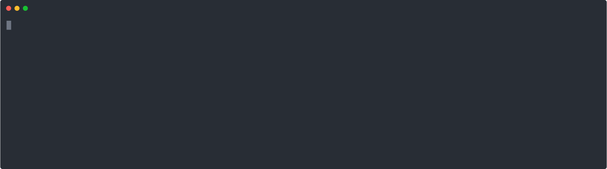

# Scaffolding for Monorepos

Code scaffolding can speed up adding new projects and packages to a [monorepo](https://en.wikipedia.org/wiki/Monorepo). In this example, we setup a monorepo with multiple starter templates for different package types. You can see this setup in action in [this sandox](https://codesandbox.io/p/sandbox/tmplr-monorepo-setup-39z54r?file=%2Ftemplates%2Fsecond-template%2F.tmplr.yml%3A6%2C39), simply fork it and run `npx tmplr` to see how it works.



👉 **STEP 1**: Add a folder at the root of your repository for your templates. Lets say we call this `.templates`.

👉 **STEP 2**: Create a folder for each template in `.templates` folder. For each template, you need a recipe and some other files (maybe a README, some boilerplate code to get started, etc.). These recipe files can be named arbitrarily, since they are not the main recipe and are just going to be used by it.

So far, our folder structure will look something like this:

```
project/
├── .templates/
│   ├── first-template/
│   │   ├── recipe.yml
│   │   ├── README.md
│   │   └── ...
│   │
│   └── second-template/
│       ├── .tmplr.yml
│       ├── README.md
│       ├── startup.mjs
│       └── ...
│
└── ...
```

<br>

👉 **STEP 3**: Write each recipe. These recipes should receive a `target` argument, which will determine the destination folder they would need to setup the new package. For example, `.templates/second-template/.tmplr.yml` might look something like this:

```yml
# .templates/second-template/.tmplr.yml
steps:

  # read the name of the package to be created.
  # this name is passed down from main recipe,
  # reading it into a local variable enables using it
  # in other files (such as `README.md`).
  #
  - read: name
    from: args.name
    
  - read: startup
    prompt: What is the name of the startup script?
    default: index.mjs

  # args.target specifies the destination
  # folder that should be populated. make sure to
  # use `path` to properly handle the address whether
  # it is relative or absolute.
  #
  - copy: README.md
    to:
      path: '{{args.target}}/README.md'

  - copy: startup.mjs
    to:
      path: '{{args.target}}/{{startup}}'
```

<br>

👉 **STEP 4**: Add a main recipe. Add a `.tmplr.yml` to the root of your project (in this example, `project/.tmplr.yml`. This recipe can ask for the name of the new package, the template it should be based on, etc.:

```yml
# .tmplr.yml
steps:
  - read: name
    prompt: What is the package name?

  - read: template
    prompt: Which template you want to use?
    choices:
      - first:
          path: './.templates/first-template/recipe.yml'
      - second:
          path: './.templates/second-template/.tmplr.yml'

  - run: '{{template}}'
    with:
      name: '{{name}}'
      target:
        path: './packages/{{name}}' # 👉 will create new packages in `packages` folder.
```

<br>

Now run `npx tmplr` to add a new package to the monorepo using one of the predefined templates.

> _thanks to [@ninomagazinovic](https://github.com/ninomagazinovic) for suggesting this use case._

<br><br>


